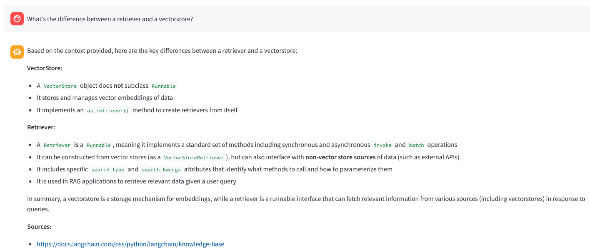

<h1 align="center">🔗 Chat with the LangChain Docs</h1>

<p align="center"><em>A grounded, fully-inspectable RAG demo — ask the LangChain documentation in plain English, get answers backed by cited sources.</em></p>

<p align="center">
  <a href="https://huggingface.co/spaces/JonasBlx/demo-rag"></a>
  <a href="https://github.com/JonasBlx/demo-rag/actions/workflows/deploy.yml"></a>
  <a href="LICENSE"></a>
  
  
</p>

<p align="center">
  
</p>

Retrieval-Augmented Generation over the live LangChain documentation: questions are embedded,
matched against an indexed corpus, and answered by **Claude** using only the retrieved context —
with the sources cited and every step of the pipeline visible.

## Live demo

**→ [huggingface.co/spaces/JonasBlx/demo-rag](https://huggingface.co/spaces/JonasBlx/demo-rag)**

Try: *“What's the difference between a retriever and a vectorstore?”*

## What it does

- **Grounded answers with citations** — replies use only the retrieved docs and link the sources; if the answer isn't there, it says so instead of hallucinating.
- **Fully inspectable** — see the retrieved chunks and their similarity scores, the exact context sent to the model, plus latency, token usage and estimated cost.
- **Production-minded** — containerized, deployed via CI/CD to Hugging Face Spaces, with cost guardrails so a public endpoint can't run away with the API bill.

## Architecture

```
INGESTION   LangChain docs (markdown) → chunking → embedding → ChromaDB   (baked in at build time)
                                                                  │
RETRIEVAL   question → embedding → cosine similarity → diversified top-k chunks
                                                                  │
GENERATION  chunks + question → prompt → Claude → answer + sources
```

## Tech stack

| Component     | Choice                                    | Why                                   |
|---------------|-------------------------------------------|---------------------------------------|
| Orchestration | LangChain (LCEL)                          | Composable retrieval/generation chain |
| LLM           | Claude Haiku 4.5 (`langchain-anthropic`)  | Fast & cheap for a public demo        |
| Embeddings    | sentence-transformers (local)             | Free, no extra key; swappable to Voyage AI |
| Vector store  | ChromaDB                                  | Local, persisted, zero infra          |
| UI            | Streamlit                                 | Minimal, inspectable front end        |
| Delivery      | Docker · GitHub Actions · HF Spaces       | Reproducible build, automated deploy  |

## Engineering decisions

- **Generation and embeddings are decoupled.** Anthropic has no embeddings API, so Claude generates while a separate embedder indexes/searches — local by default, Voyage AI via one env var.
- **Markdown ingestion, not HTML scraping.** The docs site is JS-rendered (scraping returns an empty shell), so ingestion fetches each page's `.md` endpoint — clean content, no headless browser.
- **Diversified retrieval.** A per-source cap stops one large page from filling every slot and crowding out the relevant ones — while keeping similarity scores for display.
- **No `temperature` sent to Claude.** Opus 4.7/4.8 reject sampling params (HTTP 400); omitting it keeps a single code path valid across every Claude model.
- **Index baked into the image.** Ingestion runs at build time, so the container is stateless and starts fast.
- **Guardrails for a public endpoint.** On the shared key: cheap model, capped `max_tokens`, a per-question length cap, a per-visitor monthly quota (by IP) so everyone gets a turn, and a global monthly budget guard — all lifted if a visitor supplies their own key.

## Run locally

```bash
python -m venv .venv && source .venv/bin/activate   # Windows: .venv\Scripts\activate
pip install -r requirements.txt
cp .env.example .env                                # set ANTHROPIC_API_KEY

python -m src.ingest                                # build the index (once)
PYTHONPATH=. streamlit run src/app.py               # → http://localhost:8501
```

## Run with Docker

```bash
docker build -t demo-rag .                          # index is built into the image
docker run -p 8501:8501 -e ANTHROPIC_API_KEY=sk-ant-... demo-rag
```

<details>
<summary><b>Deployment (CI/CD → Hugging Face Spaces)</b></summary>

Every push runs the tests; a push to `dev` or `main` mirrors the repo to a Hugging Face Space,
which rebuilds the Docker image. The deploy step stays skipped until `HF_SPACE` is set.

One-time setup:

1. Create a Space → **SDK: Docker**.
2. On the Space, add the secret `ANTHROPIC_API_KEY`.
3. In the GitHub repo (*Settings → Secrets and variables → Actions*): secret `HF_TOKEN` (write scope), variables `HF_USERNAME` and `HF_SPACE`.
4. Push to `dev` — the workflow deploys; HF builds and serves the app on port 8501.

</details>

<details>
<summary><b>Configuration</b></summary>

All via environment variables (see [`.env.example`](.env.example)):

| Variable | Default | Purpose |
|---|---|---|
| `ANTHROPIC_API_KEY` | — | Anthropic API key (required) |
| `ANTHROPIC_MODEL` | `claude-haiku-4-5` | Generation model |
| `MAX_TOKENS` | `1024` | Cap on answer length |
| `RETRIEVAL_K` | `4` | Chunks retrieved per question |
| `EMBEDDING_BACKEND` | `local` | `local` or `voyage` |
| `MAX_QUESTION_CHARS` | `500` | Max characters per question |
| `MAX_REQUESTS_PER_USER_PER_MONTH` | `20` | Per-visitor monthly quota (by IP) |
| `MAX_REQUESTS_PER_MONTH` | `500` | Global monthly budget guard (all visitors) |

</details>

## Project layout

```
src/
  config.py   # 12-factor config: LLM + embeddings + guardrails
  ingest.py   # docs (markdown) → chunks → embeddings → ChromaDB
  rag.py      # retrieve (diversified) → build context → generate
  app.py      # Streamlit UI, fully inspectable
scripts/
  inspect_index.py   # debug the index & retrieval
tests/                # network-free smoke tests
.github/workflows/    # CI/CD (test + deploy)
Dockerfile            # prod image (= the HF Space)
```

## Development

```bash
pip install pytest ruff
pytest        # smoke tests
ruff check .  # lint
```

## License

[MIT](LICENSE)
